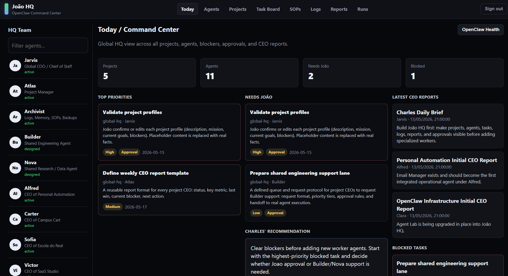
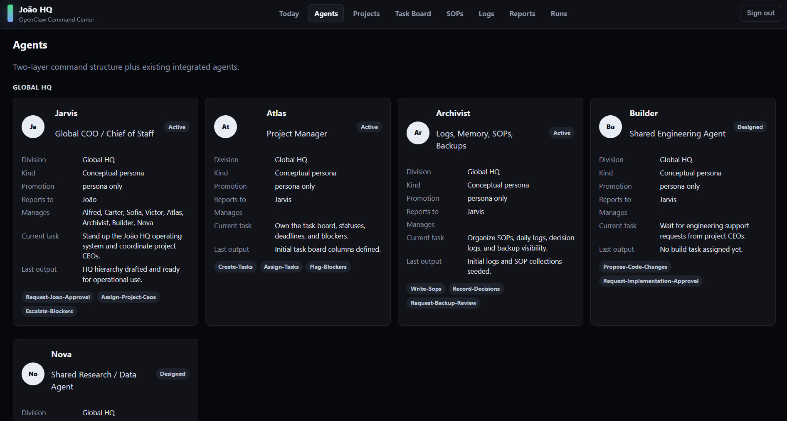
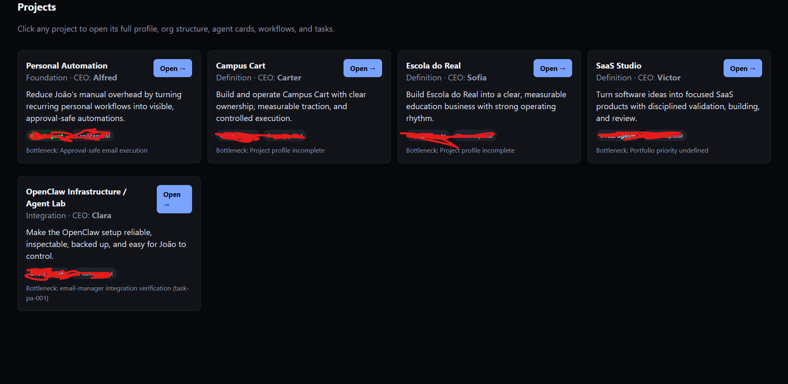
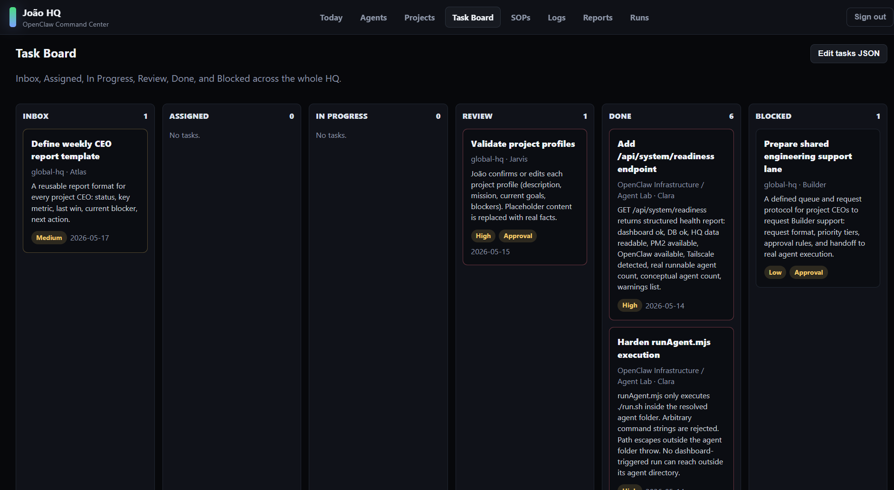
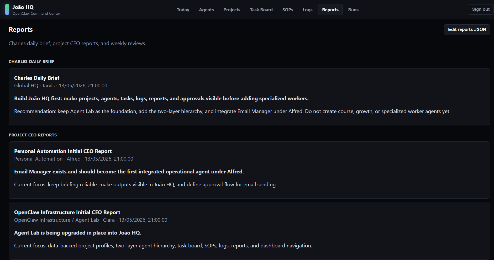

# OpenClaw Startup HQ

**A local command center for running AI agents like a small startup team.**

OpenClaw Startup HQ is the publishable part of my personal automation setup: a dashboard and agent-control layer that connects OpenClaw with a headquarters-style interface. The idea is simple: every agent has a role, skills, logs, outputs, and a lifecycle. The HQ can see which workers are only ideas, which are designed personas, and which are real runnable agents.

I built this because I wanted my agents to feel less like random scripts and more like a coordinated team: a chief of staff, project leads, specialists, and workers that can be promoted from a plan into an executable folder.



## My Use Case

I use this as a private AI operations room on a mini PC. The mini PC runs my local OpenClaw setup, keeps the dashboard online, stores agent state, and lets me coordinate multiple projects without exposing my private runtime data.

The goal is not just to chat with one assistant. The goal is to build a small startup-like operating system where each agent has a job:

- a chief-of-staff agent to decide what needs attention
- project CEO personas for different projects
- worker agents for email, research, engineering, reports, and operations
- approval-safe workflows so sensitive actions stay under my control
- logs, reports, tasks, and outputs that make the whole system inspectable

The dashboard is my headquarters. OpenClaw is the automation/runtime layer. Agent folders are the workers.

## What This Does

- Creates a browser-based headquarters for multiple AI agents.
- Separates conceptual personas from real executable workers.
- Gives each worker a project, role, lifecycle status, prompt, logs, and outputs.
- Runs agents through a constrained `./run.sh` boundary instead of arbitrary shell commands.
- Tracks runs, health, events, outputs, and artifacts in SQLite.
- Keeps HQ state in editable JSON for projects, tasks, reports, SOPs, and agents.
- Adds readiness checks for dashboard health, database state, PM2, OpenClaw, and private-network access.

## Why I Built It

My goal is to use OpenClaw as the automation runtime and this HQ as the operating system around it.

Instead of one general-purpose bot trying to do everything, I can create focused workers:

- an email manager for daily briefings
- a researcher for project discovery
- a builder for implementation tasks
- a project lead that decides what needs attention
- an archivist that keeps logs, reports, and SOPs organized

That structure makes the system easier to reason about. A worker can start as an idea, become a designed persona, then become a real folder with `agent.config.json`, `prompt.md`, `run.sh`, `logs/`, and `outputs/`.

## Architecture

```text
openclaw-startup-hq/
├── dashboard/backend/       # Express dashboard and API
│   ├── lib/                 # agent scanning, readiness, runs, HQ state
│   └── public/              # browser UI
├── scripts/                 # create/register/start/stop agent helpers
├── agents/                  # runnable worker-agent folders
├── examples/hq/             # sample HQ JSON state
└── docs/screenshots/        # dashboard screenshots for GitHub
```

The main layers are:

1. **OpenClaw runtime**: the local automation runtime and provider gateway.
2. **Startup HQ dashboard**: the browser interface, SQLite run history, and JSON command-center state.
3. **Worker agents**: folders with clear prompts, configs, logs, outputs, and a single safe entrypoint.

## Stack

This is the stack I am using around the HQ:

- **Mini PC** as the always-on local machine.
- **OpenClaw** as the local agent/runtime gateway.
- **Node.js** for the dashboard backend and worker scripts.
- **Express** for the local dashboard API.
- **SQLite** for registered agents, run history, sessions, and events.
- **JSON files** for HQ state: projects, agents, tasks, SOPs, logs, and reports.
- **PM2** to keep the dashboard process running.
- **systemd user services** for long-running local automation services.
- **Tailscale/private networking** for private access to the dashboard when I am away from the machine.
- **Shell entrypoints** through `run.sh` so every worker has one clear execution boundary.

## Agent Lifecycle

| Status | Meaning |
| --- | --- |
| `idea` | A rough concept only. |
| `designed` | A persona or role exists in HQ JSON. |
| `scaffolded` | A folder exists, but it is not fully runnable yet. |
| `runnable` | Required files exist and the agent can run manually. |
| `scheduled` | Runnable and connected to timer/cron behavior. |
| `active` | Operational and expected to work now. |
| `disabled` | Intentionally inactive. |
| `failed` | Last known operational state is bad. |

The dashboard computes whether an HQ entry is a `conceptual-persona` or an `executable-agent`.

## Runnable Agent Shape

Every real worker agent uses this shape:

```text
agents/<project>/<agent-id>/
├── agent.config.json
├── prompt.md
├── run.sh
├── logs/
└── outputs/
```

The dashboard only runs `./run.sh` inside the resolved agent folder. That keeps the command surface intentionally small.

## Quick Start

```bash
git clone https://github.com/7thcapitalist/Openclaw-Agents-Headquarter.git
cd Openclaw-Agents-Headquarter
cp .env.example .env
npm run setup
npm run seed:hq
npm run register:example
npm run dev
```

Open `http://127.0.0.1:3000` and log in with the password from `.env`.

## Create A Worker

```bash
./scripts/create-agent.sh personal-automation email-manager
```

Then edit:

- `agents/personal-automation/email-manager/agent.config.json`
- `agents/personal-automation/email-manager/prompt.md`
- `agents/personal-automation/email-manager/run.sh`

Register it in the dashboard database:

```bash
./scripts/register-agent.sh personal-automation email-manager
```

## OpenClaw Integration

This repo does not include private OpenClaw state. In my local setup, OpenClaw runs separately and this HQ calls into it through agent `run.sh` wrappers and health checks.

For example, a worker can wrap an OpenClaw command, a cron job, a Node script, or any local automation as long as the dashboard entrypoint remains `./run.sh`.

## Screenshots

These are real screenshots from my current dashboard. Some private details are intentionally redacted.

### Today / Command Center


### Agents



### Projects



### Task Board



### Reports



## What Is Not Included

This repo intentionally excludes:

- private `~/.openclaw` runtime data
- tokens and auth profiles
- Telegram, Gmail, or provider credentials
- local SQLite runtime databases
- personal logs and generated outputs

## Status

This is an early public slice of a private system. The core idea is working: a local headquarters that can organize agent personas, promote them into real workers, and run them through a safer operational boundary.
